# Financial Statements & Annual Report Intelligence

**A local, open-source RAG system — hybrid retrieval, reranking, and an on-device LLM, evaluated with RAGAS.**

Ask natural-language questions about SEC 10-K filings and get answers grounded in the actual filing text — every claim cited, every number checked against its source, and a refusal instead of a guess when the filings don't say. The entire stack, including the language model itself, runs locally: no cloud API, no API key, no data ever leaves the machine.


---

## Table of Contents

- [Why this exists](#why-this-exists)
- [Architecture](#architecture)
- [Pipeline stages](#pipeline-stages)
- [Key features](#key-features)
- [Tech stack](#tech-stack)
- [Project structure](#project-structure)
- [Getting started](#getting-started)
  - [Prerequisites](#prerequisites)
  - [Installation](#installation)
  - [Getting the data](#getting-the-data)
  - [Running the pipeline](#running-the-pipeline)
  - [Running the API and UI](#running-the-api-and-ui)
- [Usage examples](#usage-examples)
- [Testing](#testing)
- [Evaluation](#evaluation)
- [What's deliberately not built](#whats-deliberately-not-built)
- [License](#license)

---

## Why this exists

General-purpose chatbots answer financial questions from training memory — which is stale, unverifiable, and prone to inventing specific numbers with total confidence. This project takes the opposite approach: every answer is retrieved from real filing text, every cited source is traceable back to an exact company/fiscal-year/section, every number in the answer is checked against the sources it claims to come from, and the system explicitly refuses to answer rather than force a guess when retrieval confidence is low or the filings genuinely don't say.

It covers 10 companies (Apple, Amazon, Berkshire Hathaway, Coca-Cola, Intel, Johnson & Johnson, Microsoft, NVIDIA, Tesla, Visa) across 5 fiscal years each — 50 real 10-K filings, ~29,900 chunks, fully indexed and queryable.

Full build history — every tool choice, every bug found and how it was root-caused and verified fixed — is documented stage by stage in [`PIPELINE_TECHNICAL_NOTES.md`](PIPELINE_TECHNICAL_NOTES.md).

## Architecture

```mermaid
flowchart LR
    A["SEC EDGAR\n10-K PDFs"] --> B["Docling / pdfplumber\nParsing"]
    B --> C["Cleaning"]
    C --> D["Metadata &\nSection Extraction"]
    D --> E["Section-Aware\nChunking"]
    E --> F["BGE-small Embeddings\n(OpenVINO, CPU)"]
    F --> G[("Qdrant\nVector Store")]
    G --> H["Hybrid Retrieval\nDense + BM25 + RRF"]
    H --> I["FlashRank\nReranking"]
    I --> J["Confidence Gate"]
    J --> K["Qwen2.5 7B\nGeneration (Ollama)"]
    K --> L["Numeric + Citation\nGrounding Checks"]
    L --> M["FastAPI\n(guardrails, cache, tracing)"]
    M --> N["Streamlit / HTML UI"]
```



## Pipeline stages

| # | Stage | What it does | Key tech |
|---|---|---|---|
| 1 | **Ingestion & Parsing** | PDF → structured Markdown, tables and headings preserved | Docling, pdfplumber |
| 2 | **Cleaning** | Strips repeated headers/page numbers | custom rules |
| 3 | **Metadata Extraction** | Ticker, company, fiscal year, section boundaries — cross-checked against SEC EDGAR's own registry | EDGAR API, scoring heuristics |
| 4 | **Chunking** | Section-bounded; tables split only at row boundaries | custom recursive splitter |
| 5 | **Embedding** | 384-dim vectors, CPU-optimized | BAAI/bge-small-en-v1.5, OpenVINO |
| 6 | **Vector Storage** | Indexed, filterable storage | Qdrant (Docker) |
| 7 | **Retrieval** | Dense + BM25 fused by Reciprocal Rank Fusion | rank-bm25, Qdrant |
| 8 | **Reranking** | Cross-encoder re-scores before generation | FlashRank (ms-marco-MiniLM-L-12-v2) |
| 9 | **Query Transformation** | Rewrite / step-back / multi-query / decompose / HyDE | swappable LLM interface |
| 10 | **Generation & Grounding** | Answer generation with numeric + citation verification and a confidence gate | Qwen2.5 7B via Ollama |
| — | **Guardrails, Caching, Observability** | Prompt-injection/PII screening, citation enforcement, SQLite response cache, JSONL request tracing | — |
| — | **Evaluation** | Faithfulness / relevancy / precision / recall, scored by an independent judge model | RAGAS, Llama 3.1 8B |
| — | **Interfaces** | REST + streaming API, two UIs | FastAPI, Streamlit |

## Key features

- **Grounded, not guessed** — every factual claim is retrieved from real filing text; nothing comes from the model's training memory
- **Hybrid retrieval** — dense semantic search and BM25 keyword search fused together, so neither a paraphrase nor an exact term is missed
- **Numeric & citation verification** — every number and every `[Source N]` citation in an answer is checked against what was actually retrieved
- **Confidence gating** — refuses to answer rather than force a response when retrieval confidence is too low
- **Query transformation** — rewrite, step-back, multi-query, decomposition, and HyDE, selectable per request
- **Guardrails** — prompt-injection and PII screening on input, citation enforcement on output
- **Response caching** — an identical question returns in milliseconds instead of minutes on repeat
- **Evaluated, not assumed** — scored with RAGAS (Faithfulness, Answer Relevancy, Context Precision, Context Recall) against an independent judge model
- **Streaming** — Server-Sent Events, token-by-token, in both the HTML and Streamlit UIs
- **100% local & open-source** — every model (embedding, reranker, generator, judge) runs on-device; zero API keys, zero cloud spend

## Tech stack

| Layer | Tools |
|---|---|
| Ingestion | Docling, pdfplumber, SEC EDGAR API |
| Chunking | custom section/table-aware splitter |
| Embeddings | sentence-transformers, BAAI/bge-small-en-v1.5, OpenVINO |
| Vector store | Qdrant (Docker) |
| Sparse retrieval | rank-bm25 |
| Reranking | FlashRank (ms-marco-MiniLM-L-12-v2) |
| Generation | Ollama, Qwen2.5 7B |
| Evaluation | RAGAS, Llama 3.1 8B (judge) |
| API | FastAPI, Server-Sent Events |
| UI | Streamlit, vanilla HTML/JS |
| Caching | SQLite |
| Testing | pytest |

## Project structure

```
sec-rag-project/
├── config/settings.py          # every tunable constant, one place
├── src/
│   ├── ingestion/               # PDF parsing, metadata/section extraction
│   ├── cleaning/                # header/boilerplate stripping
│   ├── chunking/                # section- and table-aware splitting
│   ├── embeddings/               # embedding model loading + encoding
│   ├── vectorstore/              # Qdrant client
│   ├── retrieval/                # dense, BM25, RRF fusion, technique dispatch
│   ├── reranking/                # FlashRank cross-encoder
│   ├── query_transformation/     # rewrite, step-back, multi-query, decompose, HyDE
│   ├── generation/                # prompts, LLM router, numeric verifier, pipeline
│   ├── guardrails/                # input/output screening
│   ├── caching/                   # response cache
│   ├── observability/             # request tracing
│   └── api/                        # FastAPI app, routes, schemas, auth
├── ui/streamlit_app.py           # Streamlit chat client
├── scripts/                      # one runner per pipeline stage
├── eval/                          # RAGAS eval set + runner
├── tests/                         # pytest suite
├── data/                          # raw PDFs, processed output (gitignored — see below)
├── docker/docker-compose.yml     # Qdrant
└── PIPELINE_TECHNICAL_NOTES.md    # full build history: every bug, every fix, why
```

## Getting started

### Prerequisites

- Python 3.11
- [Docker](https://www.docker.com/) (for Qdrant)
- [Ollama](https://ollama.com/) (for local LLM inference)

### Installation

```bash
git clone https://github.com/Prathika2004/Financial-Statements-Annual-Report-Intelligence.git
cd Financial-Statements-Annual-Report-Intelligence
python -m venv .venv
.venv\Scripts\activate        # Windows
# source .venv/bin/activate    # macOS/Linux
pip install -r requirements.txt
```

Pull the models this project uses:

```bash
ollama pull qwen2.5:7b      # generation
ollama pull llama3.1:8b     # evaluation judge (only needed to run eval/run_ragas.py)
```

Start Qdrant:

```bash
cd docker
docker compose up -d
```

### Getting the data

Raw PDFs and every derived artifact (cleaned text, chunks, embeddings) are **not included in this repository** — they're multiple gigabytes combined and are excluded via `.gitignore`. To reproduce the dataset, place your own 10-K PDFs under `data/raw_pdfs/<company>/<ticker>_10K_<year>.pdf`, for example:

```
data/raw_pdfs/tesla/tesla_10K_2021.pdf
data/raw_pdfs/tesla/tesla_10K_2022.pdf
data/raw_pdfs/intel/intc_10K_2021.pdf
```

10-K PDFs can be downloaded directly from [SEC EDGAR](https://www.sec.gov/edgar/search/).

### Running the pipeline

Run each stage in order (each writes its output into `data/processed/<company>__<filename>/`):

```bash
python scripts/run_ingestion.py       # parse, clean, extract metadata + sections
python scripts/run_chunking.py        # section- and table-aware chunking
python scripts/run_embedding.py       # embed every chunk
python scripts/run_qdrant_upload.py   # upload to Qdrant
```

Each script accepts `--limit N` (process only the first N filings) or `--folder <name>` (process one filing) for testing on a subset first.

### Running the API and UI

```bash
uvicorn src.api.main:app --host 127.0.0.1 --port 8000
```

This serves the REST/streaming API **and** the plain HTML UI at `http://127.0.0.1:8000`.

For the Streamlit chat interface (in a second terminal, with the API already running):

```bash
streamlit run ui/streamlit_app.py
```
→ `http://localhost:8501`

## Usage examples

```bash
# Health check
curl http://127.0.0.1:8000/health

# List available companies
curl http://127.0.0.1:8000/tickers

# Ask a question (blocking)
curl -X POST http://127.0.0.1:8000/ask \
  -H "Content-Type: application/json" \
  -d '{"question": "What was Tesla'\''s net income in fiscal year 2023?", "ticker": "TSLA", "fiscal_year": 2023}'

# Ask a question with a query-transformation technique
curl -X POST http://127.0.0.1:8000/ask \
  -H "Content-Type: application/json" \
  -d '{"question": "What are common cybersecurity risks across companies?", "technique": "multi-query"}'
```

`/ask/stream` serves the same request over Server-Sent Events for token-by-token streaming — used by both UIs.

## Testing

```bash
pytest tests/ -v
```

The suite is fast and fully offline — every test that would otherwise need a live model, Qdrant, or Ollama connection uses a fake/mock in its place, isolating pure logic (parsing, fusion, guardrail rules, cache keys, dispatch logic) from live infrastructure. Stages that genuinely need live infrastructure (model loading, real retrieval) are validated with manual smoke-test scripts instead — see each module's `if __name__ == "__main__"` block.

## Evaluation

```bash
python eval/run_ragas.py                 # full eval set
python eval/run_ragas.py --limit 3        # first 3 questions
python eval/run_ragas.py --ids <id1>,<id2>  # re-check specific questions
python eval/run_ragas.py --skip N          # resume after a partial run
```

Scored with [RAGAS](https://github.com/explodinggradients/ragas) against an independent judge model (Llama 3.1 8B — deliberately a different model and lineage than the answering model, so the pipeline isn't graded by the same model that answered). Results are written incrementally to `data/eval_set/ragas_results.json` so a single failed question never loses already-scored results.

## What's deliberately not built

Not every stage in a "complete" RAG architecture is built here — some are documented as intentionally skipped, with the reasoning:

- **Context compression** — deferred pending evidence; once evaluation existed, Context Precision scored 0.94–1.0, meaning retrieval was already returning almost nothing irrelevant to compress
- **Full auth/RBAC** — a single optional API key is proportionate for a local, single-user tool; OAuth/JWT/RBAC would solve a multi-user problem this project doesn't have
- **Managed observability (LangSmith/Phoenix/OpenTelemetry)** — a local JSONL trace log covers the actual need without a hosted dashboard or account

See [`PIPELINE_TECHNICAL_NOTES.md`](PIPELINE_TECHNICAL_NOTES.md) for the full reasoning behind every build and non-build decision.

## License

MIT — see [LICENSE](LICENSE).
